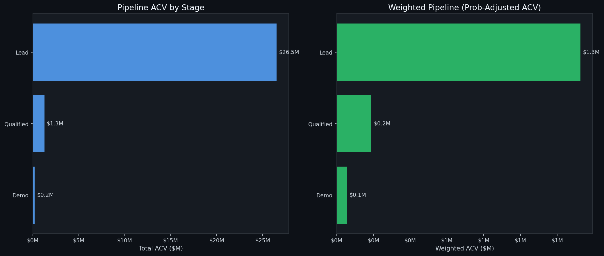
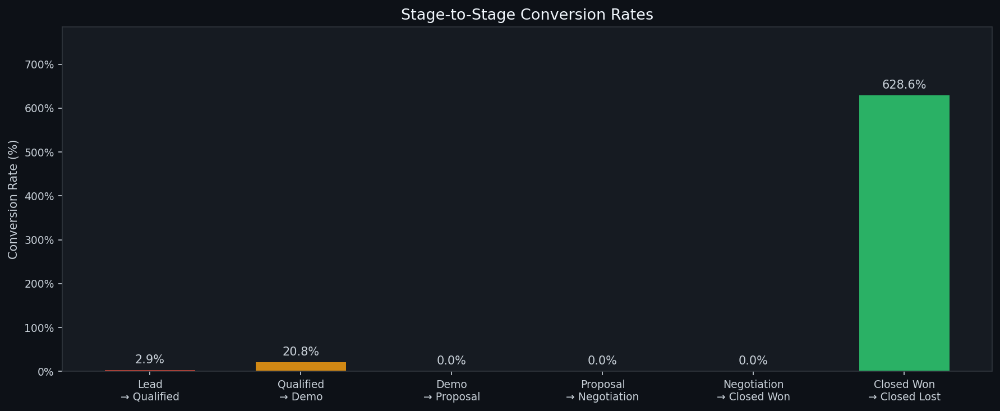
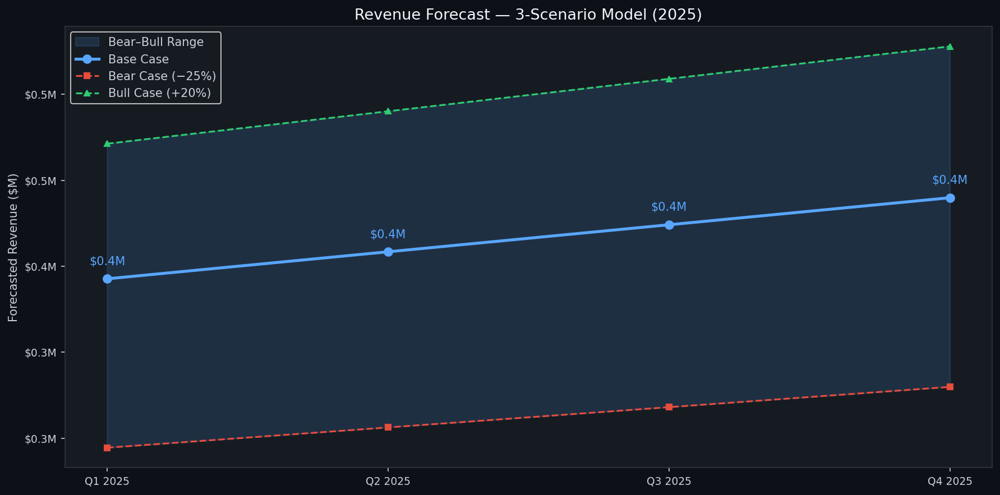
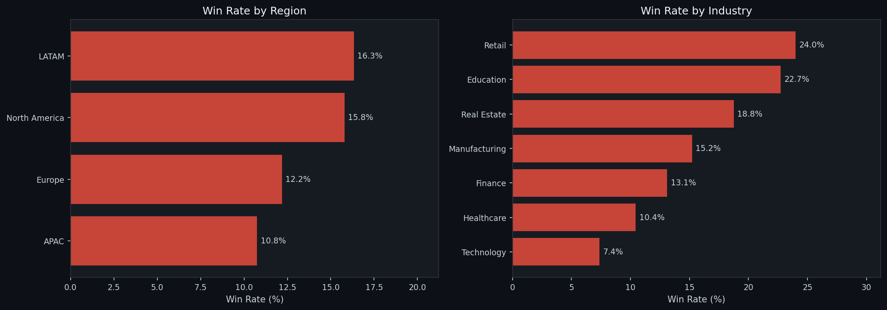
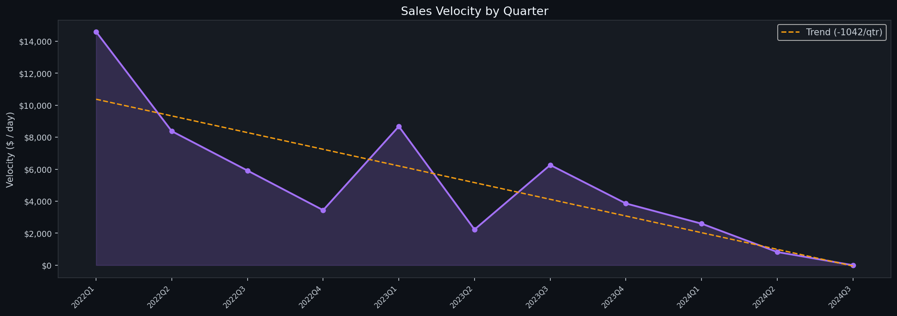
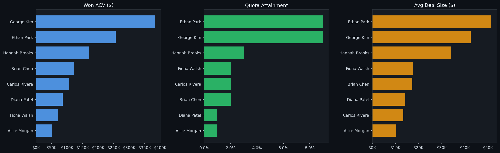
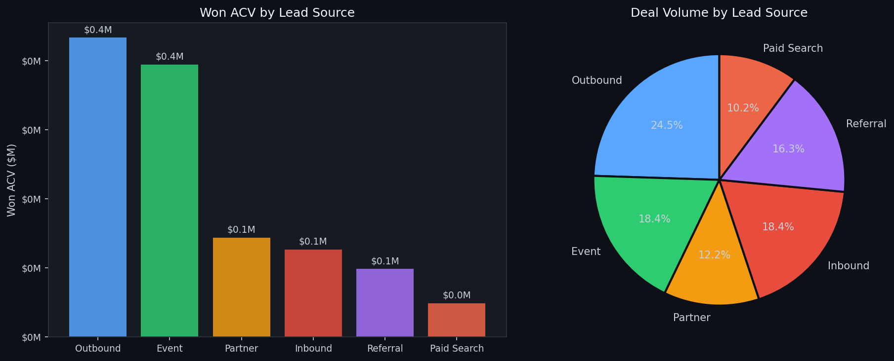

# 📊 CRM Sales Pipeline & Revenue Forecasting

[](https://python.org)
[](data/CRM_Sales_Pipeline.xlsx)
[](TABLEAU_GUIDE.md)
[](LICENSE)

> A full-stack CRM analytics project: 1,200+ synthetic B2B deals, end-to-end sales pipeline analysis, a professional Excel workbook with formulas, and a Tableau-ready export — all powered by Python.

---

## 🗺️ What's Inside

| Layer | What | File |
|-------|------|------|
| **Data** | 1,200 deals, 13K+ activities, monthly quota targets | `data/*.csv` |
| **Analysis** | Pipeline health, conversion rates, velocity, forecast | `src/analysis.py` |
| **Charts** | 7 dark-themed matplotlib visualisations | `plots/` |
| **Excel** | 4-sheet workbook with formulas, KPI dashboard | `data/CRM_Sales_Pipeline.xlsx` |
| **Tableau** | Flat export sheet + calculated field guide | `TABLEAU_GUIDE.md` |

---

## 📊 Visual Results

### Pipeline Funnel


### Stage Conversion Rates


### Revenue Forecast (3 Scenarios)


### Win Rates by Region & Industry


### Sales Velocity Trend


### Rep Leaderboard


### Lead Source Analysis


---

## 📁 Project Structure

```
crm-analysis/
├── data/
│   ├── crm_deals.csv            # 1,200 B2B SaaS deals (2022-2024)
│   ├── crm_activities.csv       # 13K+ call/email/meeting log
│   ├── monthly_targets.csv      # Monthly quota per rep
│   └── CRM_Sales_Pipeline.xlsx  # 4-sheet Excel workbook
├── notebooks/
│   ├── 01_eda.ipynb
│   ├── 02_pipeline_analysis.ipynb
│   └── 03_revenue_forecasting.ipynb
├── src/
│   ├── data_generator.py        # Synthetic CRM data generator
│   ├── analysis.py              # Metrics: velocity, win rate, forecast
│   ├── visualise.py             # Chart library
│   └── excel_builder.py        # openpyxl Excel workbook builder
├── plots/                       # Auto-generated charts
├── main.py                      # End-to-end runner
├── requirements.txt
└── TABLEAU_GUIDE.md             # Step-by-step Tableau dashboard guide
```

---

## 🚀 Quick Start

```bash
git clone https://github.com/YOUR_USERNAME/crm-analysis.git
cd crm-analysis
pip install -r requirements.txt
python main.py
```

This generates all CSVs, charts, and the Excel workbook in one go.

---

## 🧠 Analysis Modules

### Pipeline Health (`analysis.py`)
- **Pipeline Summary** — deal count, total ACV, and probability-weighted ACV per stage
- **Conversion Rates** — stage-to-stage funnel drop-off
- **Win Rate by Dimension** — slice by region, industry, product, or rep

### Sales Velocity
```
Velocity = (# Deals × Win Rate × Avg ACV) / Avg Sales Cycle Length
```
Tracked quarterly to reveal acceleration or stagnation trends.

### Revenue Forecast
3-scenario model built from the live weighted pipeline:
| Scenario | Adjustment |
|----------|-----------|
| 🐻 Bear  | −25% |
| 📊 Base  | Weighted pipeline |
| 🐂 Bull  | +20% |

### Rep Leaderboard
Ranks reps by Won ACV, quota attainment, avg deal size, and win rate — colour-coded by performance tier.

---

## 📗 Excel Workbook

The `CRM_Sales_Pipeline.xlsx` file has four sheets:

| Sheet | Contents |
|-------|----------|
| 📊 Dashboard | KPI cards, pipeline by stage, 3-scenario forecast — all formula-driven |
| 📋 Deal Data | Full deal table with filters |
| 🏆 Rep Performance | Leaderboard + monthly quota vs actual |
| 📤 Tableau Export | Flat, enriched table with calculated columns for direct Tableau connection |

Colour conventions follow industry standards:
- 🔵 Blue text = hardcoded inputs
- ⚫ Black text = formulas
- 🟢 Green = good performance
- 🟡 Amber = at-risk
- 🔴 Red = below target

---

## 📈 Tableau Setup

See [TABLEAU_GUIDE.md](TABLEAU_GUIDE.md) for:
- Connecting Excel/CSV to Tableau
- 5 calculated fields to create
- 4 recommended dashboard layouts
- Filters and publish instructions

---

## 🔮 Possible Extensions

- [ ] Connect to a real CRM via Salesforce / HubSpot API
- [ ] Train an XGBoost model to predict deal win probability
- [ ] Add a churn risk score for existing customers
- [ ] Build a Streamlit web app for live pipeline monitoring
- [ ] Schedule daily data refresh with Airflow or GitHub Actions

---

## 📦 Dependencies

```
pandas, numpy, matplotlib, seaborn, openpyxl, scikit-learn, jupyterlab
```

---

## 📄 License

MIT — free to use and adapt with attribution.

---

*Built with Python 3.11 · openpyxl · matplotlib · seaborn*
